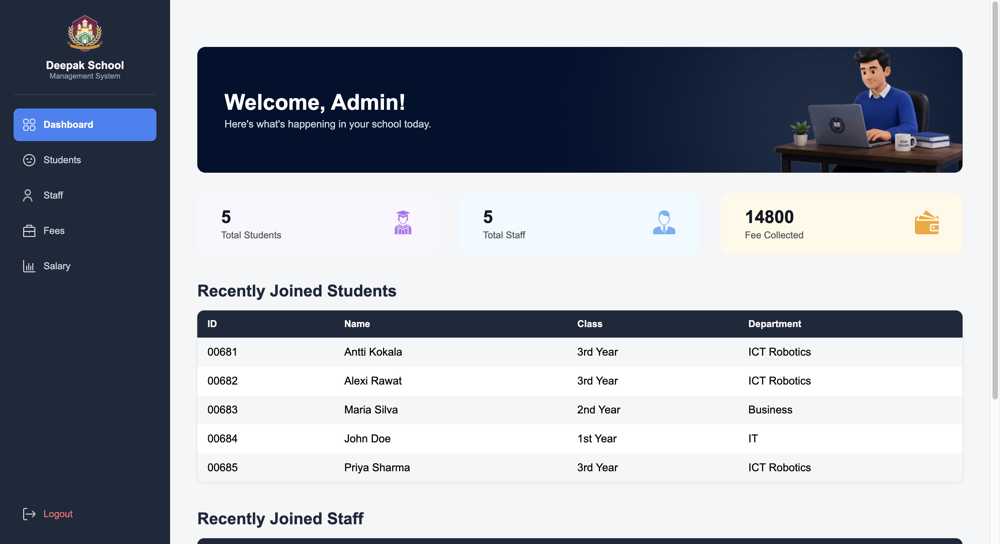

# 🏫 School Management System

A full-stack school management dashboard built with **Python (Flask)**, **HTML/CSS**, and **JSON-based data storage**. Manages students, staff, fee collection, and salary payments through a clean, custom-designed web interface.




## ✨ Features

- **Student Management** — add students with full profile details (contact info, guardian info, class, department), auto-generated unique student IDs, duplicate-name protection
- **Staff Management** — add staff with role, subject, qualification, and salary details, auto-generated unique staff IDs
- **Fee Management** — link fee records to existing students, track total/paid/due amounts, live payment status (Not Paid / Partially Paid / Fully Paid)
- **Salary Management** — track and process staff salary payments with the same due/paid/status logic
- **Dashboard Overview** — live stats (total students, total staff, total fees collected), recently joined students/staff tables, custom banner
- **Persistent storage** — all data saved to and loaded from JSON files, so records survive server restarts

## 🛠️ Tech Stack

- **Backend:** Python, Flask
- **Frontend:** HTML, CSS, Jinja2 templating
- **Data storage:** JSON files
- **Architecture:** Object-oriented design with class inheritance (`Fee` and `Staff` structured around a shared `Student`-style pattern)

## 📁 Project Structure

```
school-management-system/
├── main.py              # Flask app and all routes
├── student.py            # Student class and student-related functions
├── staff.py               # Staff class and staff-related functions
├── fee.py                  # Fee class (inherits Student) and fee-related functions
├── seed_data.py            # One-time script to populate sample data
├── data/
│   ├── students.json
│   ├── staffs.json
│   └── fees.json
├── templates/
│   ├── base.html          # Shared layout (sidebar, nav)
│   ├── home.html          # Dashboard
│   ├── students.html
│   ├── staff.html
│   ├── fees.html
│   └── salary.html
└── static/
    ├── style.css
    └── img/
```

## 🚀 Getting Started

### Prerequisites

- Python 3.9 or higher
- pip

### Installation

1. Clone the repository
   ```bash
   git clone https://github.com/Kcabhishek23/school-management-system.git
   cd school-management-system
   ```

2. Install Flask
   ```bash
   pip3 install flask
   ```

3. (Optional) Load sample demo data
   ```bash
   python3 seed_data.py
   ```

4. Run the app
   ```bash
   python3 main.py
   ```

5. Open your browser and visit
   ```
   http://127.0.0.1:5000
   ```

## 🧠 What I Learned

This project was built as a hands-on way to practice core Python and web development concepts:

- Object-oriented programming — classes, inheritance, `super()`
- File I/O and JSON serialization for data persistence
- Building a multi-page web app with Flask (routing, forms, GET/POST handling)
- Jinja2 templating and template inheritance
- Debugging a real architectural bug — a subtle issue where creating `Fee` objects silently consumed `Student` ID numbers through inherited `__init__` calls, fixed at the root by making ID generation optional
- Basic responsive UI design with Flexbox and CSS Grid

## 🔮 Possible Future Improvements

- Edit and delete functionality for students, staff, and fee records
- Search functionality across all sections
- Migrate from JSON storage to a proper database (SQLite/PostgreSQL)
- User authentication and role-based access (admin/teacher/student logins)
- Attendance and grades tracking modules

## 📄 License

This project is open source and available for learning purposes.

---

Built as part of a self-directed learning journey into Python and web development. 🚀